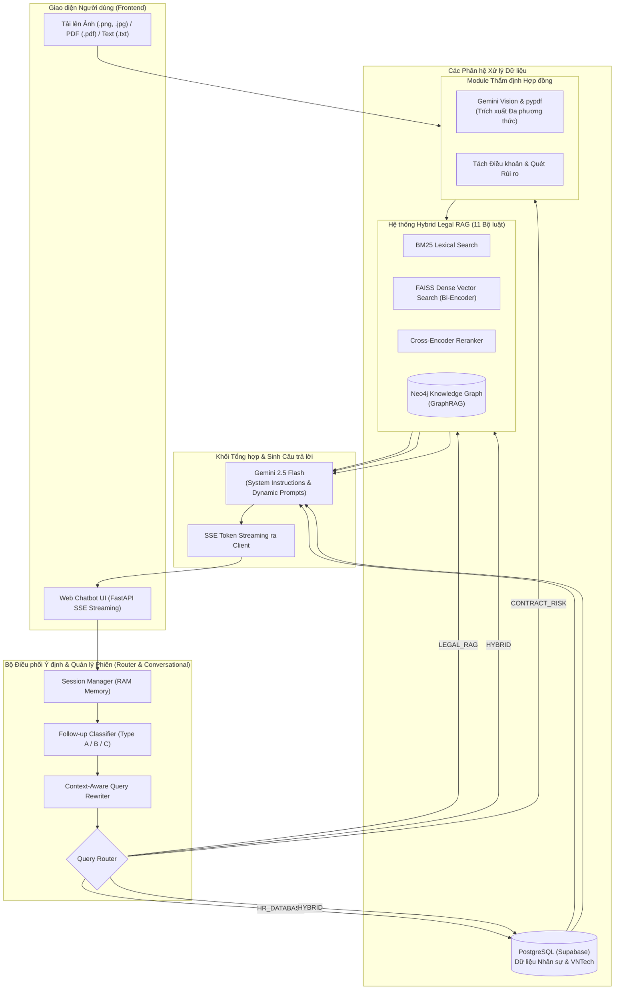

# ⚖️ VNTech Legal AI & Contract Review Assistant
> **Hệ thống Trợ lý Pháp luật, Quản trị Nhân sự & Thẩm định Rủi ro Hợp đồng Thông minh**  
> Ứng dụng **Hybrid Legal RAG (BM25 + FAISS + Cross-Encoder + GraphRAG Neo4j)**, **Conversational Query Rewriting**, **Cơ sở dữ liệu Doanh nghiệp (PostgreSQL)** và **Gemini Multimodal Document Processing**.

---

## 📌 Tổng quan Dự án

**VNTech Legal AI** là hệ thống trợ lý ảo toàn diện được xây dựng nhằm giải quyết bài toán tư vấn pháp lý chuyên sâu, quản trị thông tin nhân sự nội bộ và thẩm định rủi ro hợp đồng tự động cho doanh nghiệp.

Hệ thống kết hợp các kỹ thuật tiên tiến nhất trong lĩnh vực **Retrieval-Augmented Generation (RAG)**:
- **Tra cứu Pháp luật Đa tầng (Hybrid RAG + GraphRAG)**: Loại bỏ triệt để hiện tượng ảo giác (hallucination), dẫn chiếu chính xác Điều/Khoản từ **11 Bộ luật Việt Nam**.
- **Điều phối Đa Ý định (Query Router)**: Tự động phân loại câu hỏi vào 5 nghiệp vụ: Tra cứu Luật, Tra cứu Nhân sự, Thẩm định Hợp đồng, Câu hỏi Kết hợp (Hybrid QA) và Lời chào.
- **Hội thoại Đa lượt Thông minh (Conversational AI)**: Phân loại câu hỏi nối tiếp (Type A: Giải thích sâu / Type B: Phát sinh tình tiết) và tự động viết lại truy vấn ngữ cảnh.
- **Thẩm định Rủi ro Hợp đồng Đa phương thức**: Hỗ trợ tải trực tiếp **File PDF**, **Ảnh chụp hợp đồng**, hoặc **Dán văn bản** để quét bẫy pháp lý và điều khoản vô hiệu.

---

## 🏛️ Kiến trúc Hệ thống (System Architecture)



---

## ✨ Các Tính Năng Nổi Bật

### 1. ⚖️ Tra cứu Pháp luật Chuyên sâu (Legal RAG)
- **Kho dữ liệu 11 Bộ luật Việt Nam**:
  - *Bộ luật Lao động 2019 (BLLĐ)*
  - *Bộ luật Dân sự 2015 (BLDS)*
  - *Luật Đất đai 2024 (LĐĐ)*
  - *Luật Doanh nghiệp 2020 (LDN)*
  - *Luật Đầu tư 2020 (LĐT)*
  - *Luật Sở hữu trí tuệ 2005 (LSHTT)*
  - *Luật Thương mại 2005 (LTM)*
  - *Luật An ninh mạng 2018 (LANM)*
  - *Luật Bảo vệ quyền lợi người tiêu dùng 2023 (BVQLNTD)*
  - *Luật Quản lý thuế 2019 (LQLT)*
  - *Luật An toàn, vệ sinh lao động 2015 (LATVSLĐ)*
- **Pipeline Hybrid RAG 4 lớp**:
  1. **Hierarchical Chunking**: Tách nhỏ văn bản chuẩn cấu trúc `Chương → Điều → Khoản`.
  2. **Lexical + Dense Retrieval**: Kết hợp BM25 và Vector FAISS (mô hình fine-tuned tiếng Việt).
  3. **Cross-Encoder Reranker**: Chấm điểm mức độ tương quan chính xác của top 15 ứng viên.
  4. **GraphRAG Neo4j**: Tự động mở rộng các điều khoản cha-con và điều khoản dẫn chiếu chéo.

### 2. 📄 Thẩm định & Rà soát Rủi ro Hợp đồng (Contract Risk Review)
- **Hỗ trợ định dạng phong phú**:
  - **File PDF** (`.pdf`): Tự động đọc layer text (nhanh) hoặc kích hoạt Gemini Document AI cho PDF scan dạng ảnh.
  - **Ảnh chụp hợp đồng** (`.png`, `.jpg`, `.jpeg`, `.webp`): OCR chữ tiếng Việt qua Gemini Vision.
  - **File text & Dán trực tiếp**: Đọc nội dung tức thì.
- **Báo cáo Thẩm định Chuyên sâu**:
  - Nhận diện các **Bẫy pháp lý** và **Điều khoản vô hiệu**.
  - Đối chiếu mức trần phạt vi phạm, điều khoản giữ giấy tờ gốc, thời gian thử việc,...
  - Đưa ra phương án sửa đổi / viết lại điều khoản cụ thể.

### 3. 👥 Quản trị Cơ sở dữ liệu Nhân sự (HRM System)
- Tra cứu danh sách nhân sự, chức vụ, phòng ban, mức lương, ngày vào làm tại VNTech.
- **Hybrid QA**: Tự động đối chiếu dữ liệu nội bộ với quy định pháp luật (Ví dụ: *"Lương thử việc của nhân viên Nguyễn Văn An có đúng luật lao động không?"*).

### 4. 🧠 Hội thoại Đa lượt (Conversational Memory)
- Nhận diện câu hỏi giải thích sâu (*"Tại sao?", "Căn cứ vào đâu?"*) → Tự động tái sử dụng căn cứ pháp lý cũ.
- Tự động bổ sung chủ ngữ và ngữ cảnh cho câu hỏi phụ thuộc (*"Thế còn với lao động nữ mang thai thì sao?"*).

---

## 📂 Cấu trúc Thư mục

```text
poc-legal-rag/
├── data/
│   ├── raw/                      # 11 văn bản luật gốc (.txt)
│   ├── processed/                # Chunks đã bóc tách (.json) & Index FAISS (.npy)
│   ├── eval/                     # Bộ câu hỏi benchmark và báo cáo đánh giá
│   └── uploads/                  # Thư mục lưu tạm file PDF/ảnh hợp đồng tải lên
├── finetune/                     # Dataset và mã nguồn Fine-tuning Embedding
├── src/
│   ├── build_embeddings.py       # Tạo vector embeddings & lưu FAISS index
│   ├── build_graph.py            # Trích xuất quan hệ và nạp tri thức vào Neo4j
│   ├── chunk_legal_text.py       # Bộ phân tách văn bản luật phân cấp
│   ├── contract_analyzer.py      # Phân tích điều khoản & thẩm định hợp đồng đa phương thức
│   ├── conversational.py         # Quản lý phiên & Tái cấu trúc truy vấn hội thoại
│   ├── database/                 # Kết nối & truy vấn PostgreSQL (Supabase)
│   ├── llm_generation.py         # Kết nối Gemini 2.5 Flash & Xử lý Prompt
│   ├── retrieve_graph.py         # Truy vấn đồ thị tri thức pháp luật (GraphRAG)
│   ├── retrieve_hybrid.py        # Pipeline Hybrid Retrieval (BM25 + FAISS + Reranker)
│   ├── router.py                 # Bộ điều phối ý định thông minh (Query Router)
│   └── prompts/                  # System Instructions & Format Templates chuyên sâu
├── static/
│   ├── app.js                    # Logic Frontend (SSE Streaming, Drag & Drop, Markdown)
│   ├── index.html                # Giao diện Web Dark Mode cao cấp
│   └── style.css                 # Bộ CSS chuẩn giao diện hiện đại
├── tests/                        # Unit tests & kiểm thử router/thẩm định
├── app.py                        # Web Server chính (FastAPI + SSE Streaming)
├── share.py / share_link.bat     # Tạo link truy cập công khai qua Cloudflare Tunnel
├── Dockerfile & docker-compose.yml # Đóng gói container Docker hoàn chỉnh
├── DOCKER_GUIDE.md               # Hướng dẫn chi tiết chạy bằng Docker
├── requirements.txt              # Danh sách thư viện phụ thuộc Python
└── .env.example                  # File mẫu cấu hình biến môi trường & API Keys
```

---

## 🚀 Hướng dẫn Cài đặt & Chạy Ứng dụng

### 1. Yêu cầu Tiên quyết
- **Python**: Phiên bản `>= 3.10`
- **Git**
- **Gemini API Key**: Đăng ký miễn phí tại [Google AI Studio](https://aistudio.google.com/)

---

### 2. Cài đặt Môi trường Cục bộ (Local Setup)

#### Bước 1: Clone Repository & Tạo Virtual Environment
```bash
git clone https://github.com/petel3126/poc-legal-agent.git
cd poc-legal-agent

# Tạo môi trường ảo
python -m venv .venv

# Kích hoạt môi trường (Windows PowerShell)
.\.venv\Scripts\Activate.ps1

# Kích hoạt môi trường (Linux/macOS)
source .venv/bin/activate
```

#### Bước 2: Cài đặt Dependencies
```bash
pip install -r requirements.txt
```

#### Bước 3: Cấu hình Biến Môi trường (.env)
Tạo file `.env` từ file mẫu `.env.example`:
```bash
cp .env.example .env
```
Mở file `.env` và điền khóa API của bạn:
```env
GEMINI_API_KEY=your_gemini_api_key_here
GEMINI_MODEL=gemini-2.5-flash

# (Tùy chọn) Cấu hình Database Supabase PostgreSQL & Neo4j
DB_HOST=aws-0-ap-southeast-1.pooler.supabase.com
DB_NAME=postgres
DB_USER=postgres.your_user
DB_PASSWORD=your_password
DB_PORT=6543

NEO4J_URI=bolt://localhost:7687
NEO4J_USER=neo4j
NEO4J_PASSWORD=your_neo4j_password
```

---

### 3. Xử lý Dữ liệu & Xây dựng Index (Chỉ cần chạy 1 lần đầu)

```bash
# 1. Tách nhỏ văn bản luật thành các Chunks có cấu trúc
python src/chunk_legal_text.py

# 2. Xây dựng Vector Embeddings và lưu FAISS Index
python src/build_embeddings.py

# 3. (Tùy chọn) Nạp đồ thị tri thức Pháp luật vào Neo4j
python src/build_graph.py
```

---

### 4. Khởi chạy Web Server

```bash
python app.py
```
👉 Mở trình duyệt và truy cập: **`http://127.0.0.1:8000`**

---

### 5. Chia sẻ Link truy cập Công khai (Cloudflare Tunnel)
Để mở link cho người khác cùng truy cập mà không cần mở port router:
```bash
# Chạy file script tự động
share_link.bat
# Hoặc chạy trực tiếp bằng python:
python share.py
```

---

## 🐳 Triển khai với Docker & Docker Compose

Nếu bạn muốn chạy trọn gói (bao gồm FastAPI Server + Neo4j Graph Database):

```bash
# Khởi động toàn bộ dịch vụ
docker compose up -d

# Xem logs trực tiếp
docker compose logs -f
```
*(Chi tiết xem thêm tại [DOCKER_GUIDE.md](file:///c:/Users/Lam/OneDrive/Desktop/poc-legal-rag/DOCKER_GUIDE.md))*

---

## 🧪 Đánh giá Hiệu năng (Benchmark)

Dự án đi kèm bộ 30 câu hỏi thẩm định pháp lý tiêu chuẩn tại `data/eval/legal_qa_eval_30.json`.
- **Độ chính xác truy xuất (Recall@5)**: Đạt `> 93%` với pipeline Hybrid Reranker.
- **Tốc độ phản hồi**: Server-Sent Events (SSE) bắt đầu sinh token đầu tiên trong `< 0.8s`.

---

## 🛡️ Bản quyền & Đóng góp
Dự án được phát triển bởi **VNTech Development Team**. Mọi đóng góp (Pull Request / Issue) đều được hoan nghênh!
