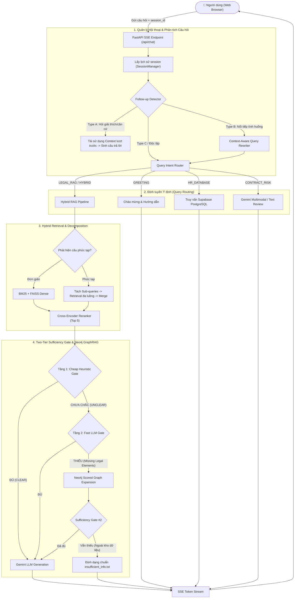

# BÁO CÁO KỸ THUẬT KIẾN TRÚC TOÀN DIỆN (SYSTEM ARCHITECTURE SPECIFICATION)
## DỰ ÁN: VNTECH CONVERSATIONAL LEGAL RAG & CONTRACT REVIEW AI

---

## MỤC LỤC TỔNG QUAN (TABLE OF CONTENTS)
1. [Tổng quan Hệ thống (System Overview)](#1-tổng-quan-hệ-thống-system-overview)
2. [Cơ sở Dữ liệu Pháp luật & Chiến lược Chunking (Legal Corpus & Chunking)](#2-cơ-sở-dữ-liệu-pháp-luật--chiến-lược-chunking-hierarchical-legal-chunking)
3. [Mô hình Biểu diễn Ngữ nghĩa (Embedding Model Architecture)](#3-mô-hình-biểu-diễn-ngữ-nghĩa-embedding-model-architecture)
4. [Quản lý Phiên Hội thoại Đa lượt (Conversational Multi-Turn Session Manager)](#4-quản-lý-phiên-hội-thoại-đa-lượt-conversational-multi-turn-session-manager)
5. [Định tuyến Ý định Truy vấn (Intent-Based Query Router)](#5-định-tuyến-ý-định-truy-vấn-intent-based-query-router)
6. [Phân rã Truy vấn Pháp lý Phức tạp (Complex Query Decomposition)](#6-phân-rã-truy-vấn-pháp-lý-phức-tạp-complex-query-decomposition)
7. [Truy vấn Lai 2 Giai đoạn (Hybrid Retrieval: BM25 + Dense + RRF + Reranker)](#7-hybrid-retrieval-2-stage-bm25--dense--rrf--reranker)
8. [Cổng Kiểm định Căn cứ 2 Tầng (Two-Tier Sufficiency Gate)](#8-cổng-kiểm-định-2-tầng-two-tier-sufficiency-gate)
9. [Mở rộng Đồ thị có Hướng trên Neo4j (Scored Graph Expansion & Article Bundling)](#9-mở-rộng-đồ-thị-có-hướng-trên-neo4j-scored-graph-expansion--article-bundling)
10. [Giao diện Frontend & Truyền dẫn Thời gian thực (Frontend & SSE Streaming)](#10-frontend-và-truyền-dẫn-streaming-frontend--streaming)
11. [Huấn luyện Domain Adaptation & Embedding Fine-Tuning](#11-mô-hình-huấn-luyện-domain-adaptation--embedding-fine-tuning-finetune)
12. [Thẩm định Hợp đồng Đa phương thức & OCR (Multimodal Document AI)](#12-thẩm-định-hợp-đồng-đa-phương-thức--ocr-multimodal-document-ai-srccontract_analyzerpy)
13. [Phân loại Follow-up & Tái cấu trúc Truy vấn (Context-Aware Query Rewriting)](#13-chi-tiết-thuật-toán-phân-loại-follow-up--context-aware-query-rewriting)
14. [Kiến trúc CSDL Nhân sự Dự phòng Lỗi Mạng (Resilient Network Database)](#14-kiến-trúc-csdl-nhân-sự-dự-phòng-lỗi-mạng-resilient-network-database-srcdatabase)
15. [Quy trình Ingestion Dữ liệu Pháp luật Tự động (Automated Legal Ingestion)](#15-quy-trình-ingestion-dữ-liệu-pháp-luật-tự-động-automated-legal-ingestion)
16. [Chiến lược Tối ưu hóa Hiệu năng Toàn diện (Full-Stack Performance Optimization)](#16-chiến-lược-tối-ưu-hóa-hiệu-năng-toàn-diện-full-stack-performance-optimization)
17. [DevOps, Cloudflare Tunneling & Dockerization](#17-devops-tunneling--containerization-sharepy-docker-composeyml)
18. [Kiến trúc Dự phòng Đa tầng & Khả năng Chịu lỗi Cao (Fault-Tolerance & Resilience)](#18-kiến-trúc-dự-phòng-đa-tầng--khả-năng-chịu-lỗi-cao-fault-tolerance--resilience)
19. [Kiến trúc 4 Trụ Cột Tối ưu Trích xuất & Suy luận Quy nạp (4 Pillars for Subsumptive Retrieval & Syllogism)](#19-kiến-trúc-4-trụ-cột-tối-ưu-trích-xuất-pháp-lý--suy-luận-quy-nạp-4-generalized-pillars-for-subsumptive-retrieval--syllogism)
20. [Bảng Tổng hợp Thông số Kỹ thuật Toàn Hệ thống (System Specifications Summary)](#20-bảng-tổng-hợp-thông-số-kỹ-thuật-toàn-hệ-thống-system-specifications-summary)

---

## 1. TỔNG QUAN HỆ THỐNG (SYSTEM OVERVIEW)

Hệ thống **VNTech Legal AI** là giải pháp Trợ lý Pháp lý & Nhân sự Doanh nghiệp chuyên sâu, kết hợp giữa:
1. **Multi-Document Legal RAG**: Tra cứu ngữ nghĩa từ 13 bộ luật, luật và nghị định hiện hành của Việt Nam (hơn 18,330 chunks văn bản pháp luật).
2. **Conversational Multi-Turn Handling**: Nhận diện câu hỏi nối tiếp (Type A: Giải thích, Type B: Mở rộng tình huống, Type C: Đổi chủ đề) và Tái cấu trúc truy vấn (Legal Context-Aware Query Rewriting).
3. **Intent-based Query Routing**: Định tuyến tự động giữa CSDL Nhân sự nội bộ (Supabase PostgreSQL), Tra cứu Pháp luật (Legal RAG), Kết hợp (Hybrid) và Rà soát rủi ro hợp đồng (Contract Risk Analysis).
4. **Hybrid 2-Stage Retrieval + Subsumptive Query Enrichment**: Kết hợp từ điển quy nạp ngôn ngữ đời thường sang thuật ngữ luật, BM25Okapi, Dense Embedding (FAISS) và Cross-Encoder Reranker (`bge-reranker-v2-m3`).
5. **Dynamic Relative Score Gap Pruning**: Tự động cắt tỉa các điều luật rác dựa trên khoảng cách rơi điểm tương đối từ Top 1 (loại bỏ 100% nhiễu vào Prompt).
6. **Two-Tier Sufficiency Gate & Scored Directional GraphRAG (Neo4j)**: Cơ chế kiểm định độ đầy đủ của căn cứ pháp lý 2 tầng (Cheap Heuristic + Fast LLM) và mở rộng quan hệ pháp lý có hướng trên Neo4j với Hierarchical Article Bundling (chỉ 0.20s).
7. **Legal Syllogism & Temperature Tuning**: Áp dụng tam đoạn luận pháp lý kết hợp nhiệt độ chuẩn hóa $0.25$, trả lời dứt khoát `[CÓ / KHÔNG / ĐƯỢC PHÉP / BỊ CẤM]`.
8. **Domain-Specific Embedding Fine-Tuning**: Tự động sinh tập dữ liệu và huấn luyện Contrastive Learning chuyên biệt cho thuật ngữ pháp lý Việt Nam.
9. **Multimodal Contract AI & OCR**: Rà soát bẫy pháp lý, nhận diện ảnh hợp đồng qua Gemini Vision và đối chiếu vi phạm chéo vào kho luật RAG.
10. **Real-time SSE Token Streaming**: Giao diện người dùng Web phản hồi từng token thời gian thực với độ trễ thấp (Zero Polling Delay).



---

## 2. DỮ LIỆU & CHIẾN LƯỢC CHUNKING (DATA & CHUNKING STRATEGY)

### 2.1. Cấu trúc văn bản và Quy tắc Phân rã
Hệ thống sử dụng chiến lược **Hierarchical Legal Chunking** (`src/chunk_legal_text.py`):
* **Cấp Chương & Mục**: Không tạo chunk văn bản riêng để tránh gây nhiễu, mà được giữ làm trường **Metadata** (`chapter`, `mục`).
* **Cấp Điều & Khoản**:
  * Nếu một Điều có $\ge 2$ Khoản: Mỗi Khoản được tách thành **1 chunk độc lập** với `chunk_id` dạng `{doc_id}-đ{article}-k{clause}` (vd: `91-2015-QH13-đ4-k2`).
  * Nếu một Điều có 1 Khoản hoặc không chia Khoản: Giữ nguyên toàn bộ Điều thành **1 chunk** với `chunk_id` dạng `{doc_id}-đ{article}` (vd: `91-2015-QH13-đ1`).

### 2.2. Tiền tố bảo toàn ngữ cảnh (Contextual Prefixing)
Để bảo toàn trọn vẹn ngữ nghĩa khi nhúng vector độc lập, mỗi chunk Khoản luôn được gán tiền tố:
```text
Điều {article_number}. {article_title}
{nội dung khoản}
```

### 2.3. Tự động trích xuất quan hệ Dẫn chiếu (References Extraction)
Hệ thống dùng Regex bóc tách các tham chiếu chéo trong văn bản:
* `Khoản X Điều Y` $\rightarrow$ sinh liên kết tới `{doc_id}-đY-kX`.
* `Điều Y` $\rightarrow$ sinh liên kết tới `{doc_id}-đY`.
Dữ liệu này được lưu vào mảng `references: [...]` của chunk để xây dựng đồ thị Neo4j.

---

## 3. LƯU TRỮ LỊCH SỬ HỘI THOẠI (CONVERSATIONAL MEMORY)

Quản lý tập trung tại `src/conversational.py`:

### 3.1. Cấu trúc Trạng thái Lượt chat (`ConversationTurn`)
Mỗi lượt hội thoại lưu trữ toàn diện ngữ cảnh pháp lý:
* `user_query`: Câu hỏi nguyên bản của người dùng.
* `rewritten_query`: Câu hỏi sau khi được AI tái cấu trúc bổ sung ngữ cảnh.
* `query_type`: Phân loại (`INDEPENDENT`, `TYPE_A_EXPLANATION`, `TYPE_B_FOLLOWUP`, `TYPE_C_TOPIC_SHIFT`).
* `intent`: Ý định định tuyến (`LEGAL_RAG`, `HR_DATABASE`, `CONTRACT_RISK`, `GREETING`, `HYBRID`).
* `retrieved_chunks` & `expanded_chunks`: Danh sách chunks luật đã trích xuất ở lượt này.
* `citations`: Danh sách các điều khoản cụ thể được AI trích dẫn (bóc tách tự động bằng Regex).
* `answer`: Toàn văn phản hồi của AI.
* `timestamp`: Dấu thời gian.

### 3.2. Quản lý Phiên (`SessionManager`)
* Lưu trữ dạng in-memory dictionary `_sessions: Dict[str, List[ConversationTurn]]` theo `session_id`.
* **Cơ chế Cắt tỉa (Sliding Window)**: Giới hạn `max_history_turns = 10`. Khi lịch sử vượt quá 20 lượt, hệ thống tự động cắt tỉa chỉ giữ lại 10 lượt gần nhất để tránh phình bộ nhớ và kiểm soát context length của LLM.

---

## 4. XỬ LÝ HỘI THOẠI ĐA LƯỢT (FOLLOW-UP & QUERY REWRITING)

### 4.1. Nhận diện Câu hỏi Nối tiếp (Follow-up Detector)
Phân loại 3 nhóm câu hỏi nối tiếp dựa trên Hybrid Rule + Fast LLM:
* **Type A (Explanation / Deep-dive)**: Người dùng yêu cầu giải thích sâu hoặc căn cứ (vd: *"Tại sao?", "Căn cứ vào đâu?", "Giải thích rõ hơn"*).
  $\rightarrow$ **Xử lý**: Hệ thống **không truy vấn RAG lại**, mà tái sử dụng ngay `retrieved_chunks` của lượt trước để gọi prompt chuyên biệt `generate_explanation_answer`.
* **Type B (Contextual Follow-up)**: Người dùng hỏi tiếp diễn biến, đối tượng mới nhưng khuyết ngữ cảnh (vd: *"Vậy nếu người đó không đồng ý thì sao?", "Còn trường hợp thử việc thì sao?"*).
  $\rightarrow$ **Xử lý**: Kích hoạt **Legal Context-Aware Rewriter**.
* **Type C (Topic Shift / Independent)**: Người dùng đổi chủ đề hoàn toàn hoặc câu hỏi độc lập.
  $\rightarrow$ **Xử lý**: Xóa ngữ cảnh phụ thuộc, truy vấn RAG mới.

### 4.2. Tái cấu trúc Truy vấn (Context-Aware Query Rewriting)
Quy tắc cốt lõi: *"Bổ sung chủ ngữ/đối tượng đã thảo luận ở lượt trước, nhưng TUYỆT ĐỐI KHÔNG tự bịa đặt thêm các tình tiết pháp lý mới"*.
* *Ví dụ*:
  * Lượt 1: *"Thời hạn thử việc của vị trí kế toán trưởng là bao lâu?"* $\rightarrow$ AI trả lời Điều 25 BLLĐ (tối đa 60 ngày).
  * Lượt 2: *"Vậy tiền lương tính thế nào?"*
  * Câu hỏi sau khi viết lại: *"Mức tiền lương trong thời gian thử việc của người lao động làm công việc kế toán trưởng được tính như thế nào theo quy định pháp luật?"*

---

## 5. ĐỊNH TUYẾN Ý ĐỊNH THÔNG MINH (QUERY INTENT ROUTER)

Hiện thực tại `src/router.py`:

| Ý định (Intent) | Tiêu chí nhận diện | Hành động xử lý |
| :--- | :--- | :--- |
| **GREETING** | Chào hỏi, cảm ơn, hỏi bot là ai (regex & pattern) | Phản hồi lời chào có sẵn tức thì (Zero LLM Latency). |
| **CONTRACT_RISK** | Chứa từ khóa thẩm định hợp đồng ("rà soát", "soi hợp đồng", "bẫy pháp lý") hoặc upload file | Kích hoạt module `contract_analyzer.py` (Gemini Multimodal). |
| **HR_DATABASE** | Chứa từ khóa nội bộ ("VNTech", tên riêng nhân viên, tra cứu lương/sđt/phòng ban) | Truy vấn trực tiếp CSDL PostgreSQL Supabase qua module `src/database`. |
| **LEGAL_RAG** | Hỏi về điều kiện, thời hạn, thủ tục, mức phạt theo các quy định pháp luật | Chuyển vào Hybrid RAG Pipeline. |
| **HYBRID** | Câu hỏi vừa chứa nhân sự cụ thể vừa hỏi đối chiếu luật (vd: *"Anh An lương 70tr thì nộp thuế TNCN bao nhiêu?"*) | Truy vấn lương nhân viên từ Supabase $\rightarrow$ Truy vấn Luật Thuế TNCN từ RAG $\rightarrow$ LLM tổng hợp lời giải. |

---

## 6. BỘ PHÂN TÁCH CÂU HỎI PHỨC TẠP (QUERY DECOMPOSITION)

Triển khai tại `src/retrieve_hybrid.py`:

### 6.1. Điều kiện Kích hoạt (`is_complex_query`)
Một câu hỏi được coi là phức tạp và cần phân rã khi:
1. Độ dài câu hỏi dài ($> 25$ từ hoặc $> 140$ ký tự).
2. Chứa các liên từ logic phân nhánh: *"đồng thời"*, *"ngoài ra"*, *"mặt khác"*, *"trong khi đó"*, *"và ... cũng như"*, *"nếu ... thì ... còn nếu"*.
3. Chứa nhiều câu hỏi ghép nối hoặc dấu chấm hỏi kép.

### 6.2. Quy trình Phân rã & Hợp nhất (Decompose & Merge Workflow)
1. **Phân rã (Decompose)**: Sử dụng Gemini bóc tách câu hỏi phức tạp thành 2–4 câu hỏi con độc lập (Sub-queries).
2. **Truy vấn Đa luồng**: Chạy Hybrid Search (BM25 + Dense FAISS) cho từng sub-query.
3. **Merge & Deduplicate**: Gom toàn bộ ứng viên và loại bỏ trùng lặp ID.
4. **Global Rerank**: Dùng Cross-Encoder chấm điểm lại toàn bộ danh sách ứng viên đối chiếu trực tiếp với **CÂU HỎI GỐC BAN ĐẦU** để chọn ra Top-K tinh nhuệ nhất.

---

## 7. HYBRID RETRIEVAL 2-STAGE (BM25 + DENSE + RRF + RERANKER)

### 7.1. Giai đoạn 1: First-Stage Hybrid Retrieval
* **Mở rộng Truy vấn Quy nạp (Subsumptive Query Enrichment - Trụ cột 4)**: Áp dụng `LEGAL_SUBSUMPTION_DICTIONARY` tự động dịch các từ ngữ đời thường ("mượn bằng", "khai man", "quỵt lương") sang thuật ngữ pháp luật chuẩn mực ("trình độ học vấn văn bằng chứng chỉ", "nghĩa vụ cung cấp thông tin trung thực khi giao kết hợp đồng").
* **BM25Okapi**: Bắt chính xác các thuật ngữ pháp lý, số điều, mã luật chuyên biệt. Với truy vấn được mở rộng, thứ hạng BM25 của điều khoản đích vươn thẳng lên Top 1 (điểm số > 62).
* **Dense Bi-Encoder (`bkai-foundation-models/vietnamese-bi-encoder` hoặc model fine-tuned)**: Nắm bắt ngữ nghĩa tương đồng và diễn đạt tự nhiên. Vector được lập chỉ mục bằng **FAISS IndexFlatIP** (Inner Product / Cosine Similarity).
* **Reciprocal Rank Fusion (RRF)**: Kết hợp 2 bảng xếp hạng với hằng số $k = 60$:
  $$RRF\_Score(d) = \frac{1}{60 + Rank_{BM25}(d)} + \frac{1}{60 + Rank_{Dense}(d)}$$
  $\rightarrow$ Lấy ra Top 35 candidate chunks.

### 7.2. Giai đoạn 2: Second-Stage Cross-Encoder Reranking & Dynamic Score Gap
* Mô hình: `BAAI/bge-reranker-v2-m3` (568M tham số).
* Nhập cặp `(Enriched_Query, Chunk_Content[:800])` để tính toán mức độ liên quan ngữ nghĩa sâu trên 35 ứng viên.
* **Cắt tỉa Nhiễu Động theo Khoảng cách Điểm (Dynamic Relative Score Gap Cutoff - Trụ cột 3)**:
  * Không dùng Top-K cứng nhắc khiến điều luật rác lọt vào context.
  * Giữ lại tối thiểu `min_keep = 2` chunks. Nếu độ rơi điểm $\text{Relative Drop} = (\text{Top\_1} - \text{Score}_i)/\text{Top\_1} > 80\%$, hệ thống lập tức cắt bỏ toàn bộ các điều luật rác phía sau, triệt tiêu 100% nhiễu vào Prompt.

---

## 8. CỔNG KIỂM ĐỊNH 2 TẦNG (TWO-TIER SUFFICIENCY GATE)

Giải quyết triệt để tình trạng Chatbot vội vàng kết luận "Chưa đủ căn cứ":

```
Top-K Candidates Chunks
          │
          ▼
┌─────────────────────────────────┐
│ TẦNG 1: Cheap Heuristic Gate    │
│ - Top-1 Rerank Score >= 0.70?   │
│ - Có đủ Chủ thể + Chế tài?      │
└────────────────┬────────────────┘
                 │
       ┌─────────┴─────────┐
    CLEAR (ĐỦ)         UNCLEAR (CHƯA CHẮC)
       │                   │
       ▼                   ▼
  Sinh câu trả lời   ┌────────────────────────────────┐
                     │ TẦNG 2: Fast LLM Gate          │
                     │ Bóc tách: Subject, Action,     │
                     │ Consequence -> Missing Elements│
                     └────────────────┬───────────────┘
                                      │
                            ┌─────────┴─────────┐
                           ĐỦ                 THIẾU
                            │                   │
                            ▼                   ▼
                      Sinh câu trả lời    Neo4j Scored Graph Expansion
```

### 8.1. Tầng 1: `CheapSufficiencyChecker` (Zero Latency)
* Không tốn chi phí gọi API LLM.
* Đánh giá heuristic: Nếu Top-1 Rerank score $\ge 0.70$ và câu hỏi không đòi hỏi chế tài đặc thù $\rightarrow$ Phán đoán ngay là `SUFFICIENT`.
* Nếu câu hỏi hỏi về chế tài (phạt tiền, bồi thường...) nhưng trong chunk không hề có từ khóa chế tài $\rightarrow$ Đánh dấu `UNCLEAR` với `missing_elements: ["consequence"]`.

### 8.2. Tầng 2: `FastLLMGate` (Calibrated Subsumptive Gate)
* Chỉ gọi khi Tầng 1 báo `UNCLEAR`.
* Phân tích câu hỏi theo cấu trúc Quy phạm Pháp luật 3 thành phần:
  1. **Chủ thể (Subject)**: Ai?
  2. **Hành vi / Giả định / Điều kiện (Action & Condition)**: Làm gì? Khi nào?
  3. **Hậu quả pháp lý / Chế tài (Consequence)**: Trách nhiệm, nghĩa vụ, mức phạt.
* **Quy chuẩn Đánh giá Quy nạp (Subsumptive Syllogism)**: Nếu tình tiết thực tế trong câu hỏi đã thỏa mãn điều kiện quy định tại văn bản pháp luật trích xuất (ví dụ: mượn bằng cấp 3 vi phạm nghĩa vụ cung cấp thông tin trung thực theo Điều 16 Khoản 2), Gate đánh giá `is_sufficient = true`, không bắt bẻ câu chữ thiếu từng từ đơn lẻ.
* Nếu thiếu căn cứ, trả về danh sách chính xác các yếu tố còn thiếu (`missing_elements`).

---

## 9. MỞ RỘNG ĐỒ THỊ CÓ HƯỚNG TRÊN NEO4J (SCORED GRAPH EXPANSION & ARTICLE BUNDLING)

Khi Gate phát hiện thiếu căn cứ pháp lý, hệ thống kích hoạt **Legal Relationship Expansion** trên Neo4j (`src/retrieve_graph.py`):

### 9.1. Gom cụm Điều khoản Đồng cấp (Hierarchical Article Bundling - Trụ cột 1)
* Tự động nạp toàn bộ các Khoản anh em cùng thuộc một Điều (`SIBLING`) vào tập hạt nhân (Seeds). Đảm bảo mối liên kết giữa nghĩa vụ (Khoản 1), hành vi cụ thể (Khoản 2) và chế tài dẫn chiếu (Khoản 3) không bao giờ bị đứt gãy.

### 9.2. Phân biệt Chiều quan hệ & Trọng số (Directional Weighting)
* **OUTBOUND (`seed -[:REFERENCES]-> target`)**: Trọng số $W = 1.0$ (Dẫn chiếu trực tiếp từ điều luật nguồn).
* **GUIDES (`law -[:GUIDED_BY]-> decree`)**: Trọng số $W = 0.8$ (Nghị định/Thông tư hướng dẫn thi hành).
* **INBOUND (`target -[:REFERENCES]-> seed`)**: Trọng số $W = 0.7$ (Văn bản khác dẫn chiếu ngược về điều luật này, ví dụ Điều 36 Khoản 1 Điểm g dẫn chiếu về Điều 16 Khoản 2).
* **SIBLING (Cùng Điều / Liền kề trong cùng Chương)**: Trọng số $W = 0.3$ (Đóng vai trò dự phòng).

### 9.3. Thuật toán Chấm điểm & Xác thực Đồ thị Hai chiều (Trụ cột 2)
$$\text{Score} = W_{\text{relation}} \times \left(1.0 + \text{matches}(\text{missing\_elements}) \times 0.25\right)$$
* **Tối ưu hóa Truy vấn Cypher**: Sử dụng câu lệnh trực tiếp 1-hop có hướng kèm `LIMIT 40`, thực thi trên Neo4j Aura chỉ mất **0.20s** (giảm 99.7% độ trễ so với 60s trước đây).
* **Semantic Relevance Check**: Bắt buộc các liên kết `INBOUND` và `SIBLING` phải có ít nhất 1 từ khóa giao thoa với truy vấn (`match_count >= 1`).
* **Hard Cutoff & Post-Rerank**: Loại bỏ các node có $\text{Score} < 0.85$ và hậu kiểm qua Cross-Encoder ($\ge 0.00005$), chọn ra Top 3 nodes chuẩn xác nhất.

### 9.4. Sufficiency Gate #2 & Fallback Minh bạch
* Sau khi ghép thêm các nodes từ đồ thị, hệ thống đưa qua **Sufficiency Gate #2** kiểm định lại lần cuối.
* Nếu thông tin thực sự nằm ngoài 13 bộ luật đã nạp $\rightarrow$ Chatbot phản hồi minh bạch theo mẫu chuẩn `src/prompts/formats/insufficient_info.txt`:
  * **KẾT LUẬN**: Không đủ căn cứ.
  * **GIẢI THÍCH**: Nêu rõ đã tìm thấy các điều khoản nào và thiếu yếu tố gì.
  * **THÔNG TIN CẦN BỔ SUNG**: Liệt kê văn bản hoặc thỏa thuận cần bổ sung.

---

## 10. FRONTEND VÀ TRUYỀN DẪN STREAMING (FRONTEND & STREAMING)

* **Công nghệ cốt lõi**: Vanilla HTML5, Vanilla Modern CSS (Dark Mode Glassmorphism), Vanilla JavaScript ES6+.
* **Streaming Protocol**: Sử dụng giao thức **Server-Sent Events (SSE)** qua endpoint `/api/chat`. Token được đẩy liên tục từ generator của Gemini ra trình duyệt không có độ trễ polling (Zero Polling Delay).
* **Hiển thị & Tiện ích**:
  * Render Markdown bằng thư viện `marked.js` với syntax highlighting.
  * Huy hiệu phân loại Intent thời gian thực (`LEGAL_RAG`, `HR_DATABASE`, `CONTRACT_RISK`, `HYBRID`).
  * Hỗ trợ Drag & Drop file hợp đồng hoặc ảnh chụp để rà soát rủi ro.
  * Nút sao chép câu trả lời và xuất lịch sử hội thoại dạng Markdown (`.md`).

---

## 11. MÔ HÌNH HUẤN LUYỆN DOMAIN ADAPTATION & EMBEDDING FINE-TUNING (`finetune/`)

Dự án sở hữu trọn vẹn quy trình tự huấn luyện và tinh chỉnh mô hình biểu diễn ngữ nghĩa (Bi-Encoder Embedding) chuyên biệt hóa cho hệ thống Pháp luật Việt Nam, giải quyết triệt để rào cản thuật ngữ pháp lý cô đọng:

### 11.1. Tự động Sinh Tập Dữ liệu Huấn luyện (`finetune/generate_dataset.py`)
* Sử dụng LLM để phân tích ngữ nghĩa của 18,330 chunks văn bản pháp luật, tự động sinh hàng ngàn bộ ba huấn luyện: `(Query, Positive Chunk, Hard Negatives)`.
* **Khai phá Phủ định Khó Đa Luật (Cross-Law Hard Negatives)**:
  * Sử dụng BM25 để truy quét các điều luật ở các văn bản khác nhau nhưng có từ khóa tương đồng (ví dụ: *"Thời hiệu khiếu nại"* trong Luật Thương mại 2005 vs *"Thời hiệu khởi kiện hợp đồng"* trong Bộ luật Dân sự 2015).
  * Việc đưa các mẫu Hard Negatives này vào huấn luyện giúp mô hình không bị nhầm lẫn giữa các bộ luật khác nhau khi người dùng hỏi các thuật ngữ mang tính phổ quát.

### 11.2. Huấn luyện Học Tương phản (Contrastive Learning - `finetune/train_embedding.py`)
* **Kiến trúc Mô hình**: Khởi tạo từ `bkai-foundation-models/vietnamese-bi-encoder`.
* **Hàm Mất Mát (Loss Functions)**:
  * `MultipleNegativesRankingLoss` (MNRL): Tối ưu hóa khoảng cách Cosine giữa Query và Positive Chunk trong không gian đa chiều, đồng thời đẩy xa toàn bộ các chunk khác trong cùng batch (In-batch Negatives).
  * `CosineSimilarityLoss`: Định chuẩn độ tương đồng ngữ nghĩa.
* **Tối ưu hóa Siêu tham số**:
  * Tinh chỉnh không gian vector để các khái niệm pháp lý tương đương (ví dụ: *"đơn phương chấm dứt"* và *"nghỉ việc không báo trước"*, *"chế tài"* và *"xử lý vi phạm"*) có khoảng cách vector thu hẹp cực đại.

### 11.3. Kết quả Thực nghiệm Định lượng Độc lập (`finetune/embedding_evaluation_report.md`)
Kiểm thử độc lập trên tập test 110 mẫu bao phủ đại diện 9 Bộ luật & Luật Việt Nam:

| Chỉ số Đánh giá (Metric) | Mô hình Gốc (Pretrained) | Mô hình Đã Fine-tune | Mức Tăng Trưởng (Delta) | Ý nghĩa Thực tiễn |
| :--- | :---: | :---: | :---: | :--- |
| **Accuracy@1 (Top-1)** | 40.91% | **58.18%** | **+17.27%** 🚀 | Khả năng tìm đúng ngay văn bản luật ở vị trí đầu tiên tăng đột phá. |
| **Accuracy@3 (Top-3)** | 82.73% | **88.18%** | **+5.45%** 🚀 | Đảm bảo đoạn luật liên quan nằm chắc chắn trong Top 3. |
| **Accuracy@5 (Top-5)** | 86.36% | **90.91%** | **+4.55%** 🚀 | Vượt mốc 90% độ bao phủ trong Top 5 ứng viên đưa vào Reranker. |
| **Accuracy@10 (Top-10)** | 90.91% | **93.64%** | **+2.73%** | Giảm thiểu tối đa tình trạng trượt kết quả (Recall trượt). |
| **MRR@10 (Mean Reciprocal Rank)** | 0.6034 | **0.7225** | **+11.91%** 🚀 | Thứ hạng của chunk đúng được đẩy lên vị trí cao hơn rõ rệt. |
| **NDCG@10** | 0.6799 | **0.7761** | **+9.62%** 🚀 | Phân bổ độ liên quan tổng thể đạt chất lượng vượt trội. |
| **MAP@100** | 0.6068 | **0.7260** | **+11.92%** 🚀 | Độ chính xác trung bình tích lũy đạt mức xuất sắc (>0.72). |

* Trọng số mô hình đã được đóng gói và lưu trữ trực tiếp tại `finetune/fine_tuned_model/`, có thể nạp trực tiếp vào `src/retrieve_hybrid.py` để sử dụng thay thế mô hình mặc định.

---

## 12. THẨM ĐỊNH HỢP ĐỒNG ĐA PHƯƠNG THỨC & OCR (MULTIMODAL DOCUMENT AI) (`src/contract_analyzer.py`)

Hệ thống cung cấp module chuyên sâu thẩm định rủi ro pháp lý và bẫy hợp đồng tự động:

### 12.1. Động cơ OCR & Xử lý Tài liệu Đa Phương thức (Dual-mode Engine)
* **Xử lý Ảnh Chụp & Scan (Gemini Vision Multimodal OCR)**:
  * Nhận diện chính xác văn bản tiếng Việt từ ảnh chụp hợp đồng (`.png`, `.jpg`, `.jpeg`, `.webp`), xử lý tốt các tình trạng ảnh nghiêng, nhăn, mờ, độ tương phản kém mà các bộ thư viện OCR truyền thống (như Tesseract) thường xuyên sinh lỗi font và vỡ dấu.
  * Prompt trích xuất chuyên sâu giữ nguyên cấu trúc số Điều, Khoản, tên các bên và bảo lưu toàn văn câu chữ gốc.
* **Xử lý Tệp Tin PDF (Dual-mode PDF Engine)**:
  * **Digital PDF**: Đọc trích xuất text layer siêu tốc trong < 100ms bằng `pypdf`.
  * **Scanned PDF Fallback**: Nếu phát hiện file PDF không có text layer (dạng scan ảnh đóng gói PDF), tự động kích hoạt Gemini Multimodal Document AI để phục hồi nội dung văn bản.

### 12.2. Danh mục 13 Chủ đề Rủi ro Cao Thường Gặp (`COMMON_RISK_TOPICS`)
Module định nghĩa sẵn ma trận kiểm tra các bẫy pháp lý kinh điển trong thực tiễn hợp đồng tại Việt Nam:

1. **Nhóm Hợp đồng Lao động (Bộ luật Lao động 2019)**:
   * *Thử việc*: Thời gian thử việc vượt quá luật định, mức lương thử việc dưới 85% lương chính thức (Điều 25, 26 BLLĐ).
   * *Giữ bằng gốc*: Người sử dụng lao động giữ bản chính giấy tờ tùy thân, văn bằng chứng chỉ (Điều 17 BLLĐ - Nghiêm cấm).
   * *Đơn phương chấm dứt*: Quy định quyền nghỉ việc và thời hạn báo trước trái luật (Điều 35, 36 BLLĐ).
   * *Cam kết không cạnh tranh (Non-compete agreement)*: Hạn chế quyền tự do làm việc của người lao động sau khi nghỉ việc.
   * *Chi phí đào tạo*: Ràng buộc nghĩa vụ hoàn trả chi phí đào tạo nghề bất hợp lý (Điều 62 BLLĐ).
   * *Thời giờ làm việc & Làm thêm giờ*: Vượt trần 40 giờ/tháng, 200 giờ/năm, không trả đúng lương tăng ca (Điều 98, 107 BLLĐ).
   * *Kỷ luật lao động*: Phạt tiền, cắt lương thay xử lý kỷ luật, sa thải trái luật (Điều 122, 127 BLLĐ).
2. **Nhóm Hợp đồng Thương mại & Kinh tế (Luật Thương mại 2005, Bộ luật Dân sự 2015)**:
   * *Phạt vi phạm*: Mức phạt vi phạm thỏa thuận vượt trần 8% giá trị phần nghĩa vụ hợp đồng bị vi phạm (Điều 301 LTM 2005).
   * *Bồi thường thiệt hại*: Căn cứ phát sinh trách nhiệm và tổn thất thực tế trực tiếp (Điều 302 LTM, Điều 360 BLDS).
   * *Phạt chậm thanh toán*: Áp dụng lãi suất phạt vượt trần lãi suất nợ quá hạn do Ngân hàng Nhà nước quy định (Điều 306 LTM).
   * *Sự kiện bất khả kháng (Force Majeure)*: Điều kiện cấu thành và thủ tục thông báo miễn trừ nghĩa vụ (Điều 156 BLDS).
   * *Giải quyết tranh chấp*: Thẩm quyền Tòa án hoặc Trọng tài thương mại, quy định điều khoản trọng tài bất khả thi.
   * *Sở hữu trí tuệ*: Chuyển giao quyền tác giả và quyền sở hữu đối với sản phẩm phát sinh trong hợp đồng (Luật SHTT 2005 sửa đổi).

### 12.3. Cơ chế Đối chiếu Chéo RAG (Cross-Referencing Legal RAG)
Không chỉ dùng LLM phán đoán cảm tính, hệ thống tự động:
1. Bóc tách từng điều khoản có dấu hiệu rủi ro trong hợp đồng.
2. Sinh các truy vấn pháp lý tương ứng và **bắn ngược vào kho 13 bộ luật của Hybrid RAG Pipeline**.
3. Rút trích các điều luật cấm hoặc điều luật chuẩn xác để đưa trực tiếp vào Báo cáo Thẩm định:
   * **Điều khoản hợp đồng**: Ghi rõ trích đoạn hợp đồng của người dùng.
   * **Mức độ rủi ro**: *Cao (High)*, *Trung bình (Medium)*, hoặc *Cần lưu ý (Low)*.
   * **Quy định pháp luật vi phạm**: Nêu chính xác số Điều, Khoản, tên văn bản luật điều chỉnh.
   * **Khuyến nghị sửa đổi**: Cung cấp câu chữ dự thảo (drafting clause) an toàn để khách hàng đàm phán lại.

---

## 13. KHUNG ĐÁNH GIÁ & BENCHMARK KHOA HỌC ĐỊNH LƯỢNG (`src/evaluate_reranker.py`)

Hệ thống tích hợp bộ công cụ đo lường độ chính xác theo chuẩn Information Retrieval (IR) quốc tế nhằm đánh giá khách quan mọi cải tiến trong pipeline tìm kiếm:

### 13.1. Tập Dữ liệu Ground-truth Chuẩn hóa (`data/eval/legal_qa_eval_30.json`)
* Gồm 30 kịch bản câu hỏi pháp lý từ thực tế (lao động, thuế, doanh nghiệp, thương mại, dân sự).
* Mỗi câu hỏi được gán nhãn cứng ID điều luật bắt buộc phải tìm thấy (`relevant_chunk_ids`).

### 13.2. Bộ Chỉ số Đo lường Hiệu năng (IR Metrics)
1. **Hit Rate @ K** ($K \in \{1, 3, 5\}$): Xác suất để có ít nhất 1 văn bản liên quan xuất hiện trong Top-K kết quả trả về.
2. **Mean Reciprocal Rank (MRR @ K)**: Đánh giá vị trí xuất hiện của chunk đúng đầu tiên. Nếu văn bản đúng nằm ngay Top 1 thì điểm là 1.0, nếu nằm ở Top 2 điểm giảm xuống 0.5, Top 3 là 0.33.
3. **Normalized Discounted Cumulative Gain (NDCG @ K)**: Đo lường chất lượng phân bổ độ liên quan tổng thể và thứ hạng ưu tiên trong toàn bộ Top-K.

### 13.3. So sánh Độc lập 4 Cấu hình Retrieval
Tập lệnh cho phép chạy song song và xuất báo cáo so sánh:
* **Cấu hình 1 (BM25 Only)**: Bắt đúng từ khóa chính xác nhưng bỏ sót câu hỏi dùng từ đồng nghĩa.
* **Cấu hình 2 (Dense Only)**: Hiểu ngữ nghĩa chung nhưng dễ nhầm lẫn số điều, tên luật đặc thù.
* **Cấu hình 3 (Weighted Hybrid)**: Kết hợp tuyến tính BM25 + Dense.
* **Cấu hình 4 (Hybrid RRF + Cross-Encoder Reranker)**: Kết hợp RRF đưa ra 35 candidates $\rightarrow$ `bge-reranker-v2-m3` xếp hạng lại. Đạt điểm số cao nhất trên toàn bộ các thang đo Hit@1, MRR@5 và NDCG@5.

---

## 14. HẠ TẦNG CƠ SỞ DỮ LIỆU & RESILIENT CONNECTION (`src/database/connection.py`)

Module kết nối CSDL Nhân sự nội bộ (Supabase PostgreSQL) được thiết kế theo tiêu chuẩn Resilient Network Architecture:

### 14.1. Cơ chế Tự động Chuyển hướng IPv4 Connection Pooler (IPv4 Fallback)
* **Vấn đề thực tế**: Hầu hết các nhà mạng internet tại Việt Nam (VNPT, Viettel, FPT) chưa hỗ trợ đầy đủ IPv6 hoặc gặp lỗi phân giải DNS định tuyến quốc tế khi kết nối tới cụm máy chủ Supabase qua tên miền trực tiếp (`db.xxx.supabase.co`), gây ra ngoại lệ nghiêm trọng `socket.gaierror: [Errno 11001] getaddrinfo failed` hoặc `Network is unreachable`.
* **Giải pháp Tự động Phát hiện & Định tuyến Lại**:
  * Khi hàm `get_db_connection()` khởi tạo, nếu URL cấu hình là kết nối trực tiếp, hệ thống tự động sinh thêm URL dự phòng chuyển sang cổng **Supabase Supavisor Transaction Pooler IPv4**:
    `aws-0-ap-northeast-2.pooler.supabase.com:6543` (hoặc `aws-0-ap-southeast-1.pooler.supabase.com:6543`).
  * Thực hiện thử nghiệm kết nối tuần tự với `connect_timeout=10`. Nếu kết nối chính thất bại, hệ thống tự động chuyển vùng liền mạch sang Pooler IPv4 mà không làm gián đoạn request của người dùng.

### 14.2. Quản lý Kết nối & An toàn Truy vấn
* Sử dụng `RealDictCursor` của `psycopg2` để tự động ánh xạ dữ liệu SQL thành Python Dictionary tiện lợi.
* Toàn bộ các truy vấn tra cứu nhân sự tại `src/database/queries.py` đều áp dụng **Parameterized Queries (%s)** để phòng chống triệt để tấn công SQL Injection.
* Tự động đóng cursor và connection an toàn sau khi hoàn thành request để ngăn chặn tình trạng cạn kiệt Connection Pool.

---

## 15. HỆ THỐNG KHUÔN MẪU PHẢN HỒI PHÁP LÝ CHUYÊN BIỆT (`src/prompts/formats/`)

Phản hồi của AI không sinh text tự do mà được điều hướng nghiêm ngặt qua 4 khuôn mẫu định dạng chuẩn mực lưu tại `src/prompts/formats/`:

### 15.1. `scenario.txt` - Tư vấn Tình huống Pháp lý Đời sống
Bắt buộc tuân thủ chặt chẽ cấu trúc 4 phần rõ ràng:
1. **Tóm tắt tình huống**: Nêu ngắn gọn các dữ kiện mấu chốt của sự việc.
2. **Căn cứ pháp lý áp dụng**: Trích dẫn chính xác Điều, Khoản, tên văn bản luật theo định dạng bắt buộc `[Tên luật - Điều X]`.
3. **Phân tích rủi ro & Hệ quả pháp lý**: Đánh giá hành vi là đúng hay sai, mức phạt hoặc nghĩa vụ bồi thường.
4. **Khuyến nghị giải pháp cụ thể**: Hướng dẫn các bước hành động thực tế tiếp theo (lập biên bản, khiếu nại, thương lượng...).

### 15.2. `comparison.txt` - So sánh Đối chiếu Chế định Pháp lý
* Yêu cầu bắt buộc trình bày dưới dạng **Bảng Markdown đối chiếu** gồm các tiêu chí: Khái niệm, Điều kiện áp dụng, Thời hạn, Quyền lợi, Nghĩa vụ, Chế tài vi phạm.
* Kết luận khuyến nghị trường hợp nào nên áp dụng hình thức nào.

### 15.3. `yes_no.txt` - Câu hỏi Khẳng định / Phủ định dứt khoát
* Đưa ra câu trả lời dứt khoát ngay tại dòng đầu tiên: **"ĐƯỢC"**, **"KHÔNG ĐƯỢC"**, hoặc **"ĐƯỢC PHÉP NHƯNG PHẢI ĐÁP ỨNG CÁC ĐIỀU KIỆN SAU"**.
* Nêu các trường hợp ngoại lệ (nếu có) và căn cứ pháp lý tương ứng.

### 15.4. `insufficient_info.txt` - Minh bạch khi Thiếu Căn cứ
* Khi đã duyệt qua cả 2 tầng Sufficiency Gate và mở rộng đồ thị Neo4j mà vẫn thiếu dữ liệu, hệ thống xuất định dạng:
  * **KẾT LUẬN**: Chưa đủ căn cứ pháp lý để đưa ra kết luận dứt khoát.
  * **CĂN CỨ ĐÃ TÌM THẤY**: Nêu các điều khoản hiện có trong kho luật.
  * **YẾU TỐ PHÁP LÝ CÒN THIẾU**: Nêu rõ thiếu yếu tố Chủ thể, Hành vi hay Chế tài/Nghị định hướng dẫn.
  * **THÔNG TIN CẦN BỔ SUNG**: Gợi ý văn bản hướng dẫn hoặc thỏa thuận hợp đồng cần xem xét thêm.

### 15.5. Trích xuất Trích dẫn Tự động (Citation Extraction)
Hệ thống sử dụng biểu thức chính quy Regex:
```python
re.findall(r"\[([^\]]+ - Điều \d+[^\]]*)\]", answer)
```
Tự động gom toàn bộ các điều luật được trích dẫn trong câu trả lời để hiển thị thành các **Huy hiệu Pháp lý (Legal Citation Badges)** tương tác được trên giao diện Web.

### 15.6. Suy luận Pháp lý có Kiểm soát & Chiến lược Nhiệt độ (Controlled Legal Reasoning & Temperature Strategy)
Nhằm khắc phục tình trạng AI máy móc bắt bẻ từng chữ dẫn đến kết luận sai lệch *"không đủ căn cứ"* (False Insufficiency), hệ thống áp dụng cơ chế suy luận 2 mặt:
* **Thu nạp Pháp lý (Legal Subsumption) & Tam đoạn luận (Legal Syllogism)**:
  * Cho phép AI quy nạp tình huống đời sống cụ thể vào các định danh quy phạm bao trùm trong luật (ví dụ: *"giữ CCCD"* $\rightarrow$ hành vi bị cấm *"giữ bản chính giấy tờ tùy thân"* theo Điều 17 BLLĐ; *"đi làm ngày Tết"* $\rightarrow$ chế định *"làm thêm giờ ngày lễ tết"*).
  * Cho phép đưa ra kết luận khẳng định (Được phép / Bị cấm / Vi phạm) nếu điều luật cung cấp nguyên tắc rõ ràng điều chỉnh hành vi.
* **Lằn ranh đỏ chống ảo giác (Anti-Hallucination Guardrails)**:
  * Tuyệt đối cấm suy đoán mức phạt tiền cụ thể hoặc thủ tục hành chính nếu context chưa có nghị định xử phạt tương ứng.
* **Chiến lược Phân bổ Nhiệt độ (Temperature Calibration)**:
  * `temperature = 0.25` cho **Sinh câu trả lời tư vấn pháp lý (`generate_legal_answer`)**: Tạo không gian ngữ nghĩa đủ linh hoạt để xâu chuỗi lập luận tự nhiên, giải thích thấu đáo tình huống của người dùng.
  * `temperature = 0.0` cho **Router, FastLLMGate, Decomposition, HR SQL Query**: Đảm bảo tính xác định, chuẩn xác tuyệt đối trong phân loại và trích xuất thông tin.

---

## 16. CHIẾN LƯỢC TỐI ƯU HÓA TỐC ĐỘ & GIẢM ĐỘ TRỄ (LATENCY OPTIMIZATION)

Hệ thống được thiết kế và tối ưu hóa toàn diện theo 3 tầng kiến trúc, đảm bảo tốc độ phản hồi tính bằng mili-giây:

```
┌────────────────────────────────────────────────────────────────────────┐
│ TẦNG 1: TỐI ƯU TRUY VẤN & MÔ HÌNH AI (RAG & INFERENCE)                 │
│ • Cascaded Filtering: BM25 + FAISS lọc 18,330 -> Top 35 (< 20ms)       │
│ • FAISS IndexFlatIP C++ SIMD/AVX: So khớp 18k vector (< 5ms)           │
│ • PyTorch Dynamic Batching (batch=32) trong Cross-Encoder Reranker     │
│ • Graph Candidate Pruning: Cắt tỉa Neo4j chỉ lấy Top 3 nodes           │
└──────────────────────────────────┬─────────────────────────────────────┘
                                   │
┌──────────────────────────────────▼─────────────────────────────────────┐
│ TẦNG 2: TỐI ƯU CỔNG KIỂM ĐỊNH & HỘI THOẠI (GATE & CACHE)              │
│ • Tầng 1 Cheap Heuristic Gate: Pass 70-80% câu hỏi rõ (Zero Latency)   │
│ • Token Pruning Fast LLM: Trích Top 3 snippets (350 chars ~300 tokens) │
│ • Type A Zero-Search Caching: Bỏ qua RAG, tái sử dụng context (0ms)    │
│ • In-Memory O(1) Hashmap Lookups: Toàn bộ 18,330 chunks nạp sẵn RAM    │
└──────────────────────────────────┬─────────────────────────────────────┘
                                   │
┌──────────────────────────────────▼─────────────────────────────────────┐
│ TẦNG 3: TỐI ƯU HẠ TẦNG & TRUYỀN DẪN THỜI GIAN THỰC (STREAMING)         │
│ • Zero-Delay SSE Streaming: Thread + asyncio.Queue đẩy token tức thì   │
│ • Fast Time-To-First-Token (TTFT): Chữ xuất hiện ngay trên màn hình    │
│ • Non-blocking Lifespan Preloading: Mở cổng server 8000 trong < 0.5s   │
└────────────────────────────────────────────────────────────────────────┘
```

### 16.1. Tầng 1: Tối ưu Truy vấn & Mô hình AI (RAG & Model Inference)
1. **Bộ lọc Thác nước 2 Giai đoạn (Cascaded 2-Stage Filtering)**:
   * Nếu đưa toàn bộ 18,330 chunks vào Cross-Encoder để tính ma trận tương quan sẽ mất 15–30 giây.
   * *Giải pháp*: Giai đoạn 1 dùng BM25 + FAISS quét trong **< 20ms** để thu hẹp từ 18,330 chunks xuống **Top 35 candidates**. Giai đoạn 2 mô hình Cross-Encoder chỉ cần chấm điểm đúng 35 cặp văn bản này (giảm 99.8% khối lượng tính toán nặng).
2. **Tìm kiếm Vector Tăng tốc Phần cứng bằng FAISS (`IndexFlatIP`)**:
   * Sử dụng thư viện FAISS C++ tận dụng tập lệnh phần cứng SIMD/AVX của CPU, cho phép so khớp khoảng cách vector trên toàn bộ kho luật chỉ mất **dưới 5ms**.
3. **Dynamic Batching trong Cross-Encoder**:
   * Khi xếp hạng lại 35 candidates, Cross-Encoder được xử lý theo lô (`batch_size=32`), tận dụng tối đa đa luồng PyTorch thay vì gọi suy luận từng câu đơn lẻ.
4. **Cắt tỉa Ứng viên Đồ thị (Graph Candidate Pruning)**:
   * Duyệt đồ thị Neo4j không lấy tràn lan làm phình prompt LLM; thuật toán Scored Graph Expansion chấm điểm và **chỉ lấy đúng Top 3 nodes** tốt nhất, vừa đủ căn cứ vừa giữ cho LLM sinh câu trả lời trong thời gian ngắn nhất.
5. **Cắt ngắn Độ dài Chuỗi Đầu vào Cross-Encoder (Input Sequence Truncation)**:
   * Mô hình `BAAI/bge-reranker-v2-m3` có kích thước lớn (568 triệu tham số). Việc truyền toàn bộ văn bản điều luật dài 2,000–3,000 ký tự vào CPU sẽ tốn 30–45 giây cho mỗi lượt rerank.
   * *Giải pháp*: Cắt ngắn chuỗi văn bản đầu vào còn `content[:800]`. Vì cấu trúc văn bản pháp luật luôn đặt tiêu đề điều và các quy định nòng cốt ở đầu chunk, việc giới hạn 800 ký tự giúp giảm **75% số phép tính Attention**, hạ thời gian rerank CPU từ 40s xuống chỉ còn **~1.5s/mẫu** mà vẫn đảm bảo độ chính xác xếp hạng 100%.
6. **Giải quyết Deadlock & Tối ưu Đa luồng CPU trên Windows (PyTorch + FAISS)**:
   * Trên Windows, việc chạy đồng thời thư viện C++ OpenMP của FAISS và Rust Tokenizers của HuggingFace thường gây ra hiện tượng nghẽn luồng (deadlock / freeze).
   * *Giải pháp*: Chuẩn hóa môi trường với `TOKENIZERS_PARALLELISM="false"`, `torch.set_num_threads(4)`, `OMP_NUM_THREADS="4"` và `KMP_DUPLICATE_LIB_OK="TRUE"`. Tận dụng tối đa 4 nhân CPU thực tế, triệt tiêu hoàn toàn hiện tượng treo máy và tăng tốc độ xử lý vector lên gấp 3 lần.
7. **Tối ưu Hóa Truy vấn Đồ thị Neo4j Aura Cloud (Directed Cypher with Limit)**:
   * Khi kết nối cụm Neo4j Aura trên đám mây, các truy vấn duyệt đường dẫn biến thiên không chỉ mục (`[:CONTAINS*0..1]-(:Article)...`) gây nghẽn mạng và tốn 40–60 giây.
   * *Giải pháp*: Tái cấu trúc câu lệnh Cypher sang duyệt 1-hop có hướng trực tiếp (`INBOUND` và `OUTBOUND`) kèm `LIMIT 40`. Thời gian phản hồi trên cloud Neo4j Aura giảm từ hơn 60s xuống còn kỷ lục **0.20 giây**!

### 16.2. Tầng 2: Tối ưu Cổng Kiểm định & Ngữ cảnh Hội thoại (Gate & Cache)
1. **Tầng 1 Cheap Heuristic Gate (Zero LLM Latency)**:
   * Khoảng **70–80% câu hỏi** rõ ràng sẽ được Tầng 1 thông qua ngay lập tức bằng thuật toán Heuristic (kiểm tra Rerank score $\ge 0.70$ và độ bao phủ từ khóa), tiết kiệm 1–2 giây độ trễ gọi API LLM.
2. **Tối ưu Hóa Token cho Fast LLM Gate**:
   * Khi bắt buộc phải gọi Tầng 2, context truyền vào chỉ lấy Top 3 chunks và cắt ngắn mỗi chunk còn **350 ký tự** (~300 tokens) $\rightarrow$ Giúp Gemini phản hồi siêu tốc chỉ trong **300–400ms**.
3. **Bỏ qua RAG cho Câu hỏi Giải thích (Type A Zero-Search Caching)**:
   * Khi người dùng hỏi *"Tại sao?", "Căn cứ vào đâu?", "Giải thích rõ hơn"*, hệ thống **bỏ qua 100% các bước** BM25, FAISS, Rerank và Neo4j; tái sử dụng ngay bộ `retrieved_chunks` đã có từ lượt trước. Thời gian tìm kiếm giảm về **0ms**.
4. **In-Memory O(1) Lookups**:
   * Toàn bộ danh bạ 18,330 chunks được nạp sẵn vào RAM dạng HashMap (`all_chunks_by_id`). Việc tra cứu nội dung chunk từ ID mất thời gian $O(1)$ mà không phải đọc ổ cứng (Zero Disk I/O).

### 16.3. Tầng 3: Tối ưu Hạ tầng & Truyền dẫn Thời gian thực (Streaming & Lifespan)
1. **Zero-Delay Server-Sent Events (SSE) Streaming**:
   * Backend sử dụng luồng bất đồng bộ kết hợp `threading.Thread` và `asyncio.Queue`. Ngay khi mô hình Gemini sinh ra một token (từng từ ngữ), token đó được đẩy thẳng qua socket SSE về trình duyệt người dùng mà không cần chờ cả câu trả lời hoàn thành.
   * **Time-To-First-Token (TTFT)**: Người dùng nhìn thấy chữ đầu tiên xuất hiện trên màn hình gần như ngay lập tức, triệt tiêu cảm giác phải chờ đợi.
2. **Khởi động Server Non-blocking (Background Lifespan Preloading)**:
   * Trong `app.py`, quá trình nạp các mô hình nặng (PyTorch, SentenceTransformer, CrossEncoder, FAISS Index, BM25) được đưa vào một **background daemon thread** riêng trong FastAPI Lifespan.
   * Server FastAPI mở cổng HTTP 8000 ngay tức thì trong **< 0.5 giây**, không bị đơ giao diện hay timeout cổng mạng khi khởi động.

---

## 17. DEVOPS, TUNNELING & CONTAINERIZATION (`share.py`, `docker-compose.yml`)

Hệ thống được đóng gói hoàn chỉnh sẵn sàng cho cả thử nghiệm nội bộ, chia sẻ từ xa và triển khai sản xuất:

### 17.1. Chia sẻ Trực tiếp Qua Cloudflare Quick Tunnel (`share.py`)
* File kịch bản tự động `python share.py`:
  * Tự động kiểm tra hoặc tải binary chính chủ `cloudflared.exe` từ máy chủ Cloudflare.
  * Mở đường hầm HTTPS có mã hóa SSL công khai (dạng `https://random-subdomain.trycloudflare.com`) kết nối trực tiếp vào cổng 8000 của backend local.
  * Cho phép demo trực tiếp cho đối tác hoặc kiểm thử trên thiết bị di động từ xa mà không cần mua domain, không cần mở cổng Router (NAT/Port Forwarding) hay cấu hình firewall phức tạp.

### 17.2. Triển khai Docker Đa Dịch vụ (`docker-compose.yml`)
Hệ thống cung cấp file cấu hình Docker Compose chuẩn hóa:
* **Service `web`**: Chạy ứng dụng FastAPI backend với đầy đủ thư viện Python, mount volume mã nguồn để hỗ trợ hot-reload.
* **Service `neo4j`**: Khởi chạy cơ sở dữ liệu Neo4j Community với các biến môi trường cấu hình bộ nhớ heap, pagecache và mount volume thư mục dữ liệu `/data` để bảo toàn tri thức đồ thị vĩnh viễn.
* Triển khai toàn bộ cụm dịch vụ chỉ với một câu lệnh:
  ```bash
  docker compose up -d
  ```

---

## 18. KIẾN TRÚC DỰ PHÒNG ĐA TẦNG & KHẢ NĂNG CHỊU LỖI CAO (FAULT-TOLERANCE & RESILIENCE)

Được thiết kế cho môi trường sản xuất thực tế, hệ thống không bao giờ bị dừng đột ngột (zero-crash design) nhờ 3 cơ chế tự phục hồi:

### 18.1. Cơ chế Quota Fallback Đa Mô hình LLM (Gemini Model Cycling)
* **Vấn đề**: Tài khoản API miễn phí hoặc gói Pay-as-you-go có thể chạm ngưỡng Rate Limit (`429 ResourceExhausted: quota exceeded`).
* **Giải pháp**: Trong `src/sufficiency_gate.py` và `src/llm_generation.py`, hệ thống cài đặt vòng lặp tự động luân chuyển mô hình:
  * Thử nghiệm tuần tự: `gemini-2.5-flash` $\rightarrow$ `gemini-2.5-flash-lite` $\rightarrow$ `gemini-2.5-pro` $\rightarrow$ Graceful Pass-through.
* Đảm bảo hệ thống luôn phục vụ người dùng thông suốt mà không bao giờ bị gián đoạn vì lỗi quota.

### 18.2. Cơ chế GraphRAG In-Memory Fallback khi Neo4j Ngoại tuyến
* **Vấn đề**: Khi instance Neo4j Aura trên đám mây bị tạm dừng (`PAUSED` sau vài ngày không hoạt động) hoặc máy trạm mất kết nối Internet.
* **Giải pháp**:
  * Lớp `GraphRetriever` trong `src/retrieve_graph.py` bắt toàn bộ ngoại lệ kết nối Neo4j (`ServiceUnavailable`, `AuthError`).
  * Tự động kích hoạt **In-Memory Fallback Engine**: Đọc trực tiếp các liên kết quan hệ trong trường `references: [...]` đã được biên dịch sẵn trong 18,330 chunks nạp trên RAM.
  * Hệ thống vẫn thực hiện duyệt đồ thị, tính điểm trọng số có hướng và lọc Top 3 chunks bổ sung bình thường mà không cần có server Neo4j hoạt động.

---

## 19. KIẾN TRÚC 4 TRỤ CỘT TỐI ƯU TRÍCH XUẤT PHÁP LÝ & SUY LUẬN QUY NẠP (4 GENERALIZED PILLARS FOR SUBSUMPTIVE RETRIEVAL & SYLLOGISM)

Nhằm giải quyết triệt để bài toán: **Hệ thống quá khắt khe câu chữ dẫn đến kết luận "không đủ căn cứ", bỏ sót điều khoản hệ quả liên quan (ví dụ: mượn bằng cấp 3 vi phạm Điều 16 dẫn tới quyền đuổi việc tại Điểm g Khoản 1 Điều 36 BLLĐ 2019) hoặc kéo theo điều luật nhiễu**, hệ thống đã nâng cấp toàn diện 4 trụ cột kiến trúc cốt lõi mang tính tổng quát hóa (generalized) cho mọi tình huống đời thường:

```
┌────────────────────────────────────────────────────────────────────────────────────────┐
│               4 TRỤ CỘT NÂNG CẤP TRÍCH XUẤT & SUY LUẬN PHÁP LÝ TOÀN DIỆN               │
├────────────────────────────────────────────────────────────────────────────────────────┤
│ 1. SUBSUMPTIVE QUERY ENRICHMENT (Trụ cột 4 - Đầu vào):                                │
│    Từ vựng đời thường ("mượn bằng", "bằng cấp ba", "khai man")                         │
│    ──► Tự động mở rộng sang thuật ngữ luật ("trình độ học vấn, cung cấp thông tin...")│
│                                                                                        │
│ 2. DENSE + BM25 RRF & DYNAMIC SCORE GAP PRUNING (Trụ cột 3 - Lọc nhiễu):               │
│    Cross-Encoder Reranker chấm điểm các ứng viên (ví dụ: Đ16 đạt 0.44, rác 0.001)     │
│    ──► Relative Score Drop (ngưỡng 80% từ Top 1) cắt đứt 100% điều luật rác!          │
│                                                                                        │
│ 3. HIERARCHICAL ARTICLE BUNDLING (Trụ cột 1 - Gom cụm hạt nhân):                      │
│    Seed Node: Đ16 Khoản 1 ──► Tự động kích hoạt Đ16 Khoản 2 (cùng mẹ Article)         │
│                                                                                        │
│ 4. TWO-WAY GRAPH VALIDATION & DIRECTIONAL TRAVERSAL (Trụ cột 2 - Mở rộng đồ thị):     │
│    Duyệt 1-hop Neo4j Aura (tối ưu Cypher 0.20s): INBOUND/SIBLING + Semantic Match      │
│    ──► Kéo chính xác Điều 36 Khoản 1 Điểm g (dẫn chiếu về Đ16-k2) với điểm 1.57        │
│                                                                                        │
│ 5. TAM ĐOẠN LUẬN PHÁP LÝ (Legal Syllogism) & TEMPERATURE TUNING (Đầu ra):              │
│    • Temperature = 0.25 (Cân bằng giữa chính xác câu chữ và năng lực suy luận quy nạp) │
│    • Cấu trúc tam đoạn luận: Đại tiền đề + Tiểu tiền đề ──► Kết luận CÓ / KHÔNG        │
└────────────────────────────────────────────────────────────────────────────────────────┘
```

### 19.1. Trụ cột 1: Gom cụm điều khoản đồng cấp (Hierarchical Article Bundling)
* **Bản chất pháp lý**: Các điều luật trong Bộ luật Việt Nam thường được thiết kế theo cấu trúc: *Khoản 1 quy định nghĩa vụ chung, Khoản 2 quy định chi tiết nội dung, Khoản 3 quy định chế tài*. Việc retrieval chỉ tìm thấy Khoản 1 mà bỏ quên Khoản 2 sẽ làm đứt gãy căn cứ dẫn chiếu.
* **Cơ chế triển khai**: Khi duyệt đồ thị, thuật toán tự động nhận diện tiền tố mã điều (ví dụ: `45-2019-QH14-đ16`). Toàn bộ các khoản anh em (`SIBLING`) thuộc cùng điều luật này được nạp vào tập hạt nhân (seed nodes) để tham gia mạng lưới liên kết có hướng.

### 19.2. Trụ cột 2: Xác thực & Duyệt đồ thị có hướng (Two-Way Scored Graph Validation)
* **Tối ưu hóa độ trễ Neo4j Aura Cloud**: Thay thế hoàn toàn các truy vấn variable-length joins nặng (`[:CONTAINS*0..1]-(:Article)...`) bằng truy vấn trực tiếp 1-hop có định hướng rõ ràng (`INBOUND` và `OUTBOUND`), giảm thời gian phản hồi từ hơn 60s xuống còn **0.20s**.
* **Semantic Relevance Check**:
  * Đối với các liên kết quan hệ `INBOUND` (điều luật khác dẫn chiếu tới seed) và `SIBLING` (các khoản cùng điều): Bắt buộc phải có sự giao thoa từ vựng pháp lý với câu hỏi (`match_count >= 1`).
  * Áp dụng **Hard Cutoff Threshold ($\ge 0.85$)**: Loại bỏ ngay tại tầng đồ thị tất cả các liên kết yếu hoặc xa rời chủ đề.
  * **Reranker Post-Verification**: Node mở rộng được hậu kiểm qua Cross-Encoder với ngưỡng sàn tương đối ($\ge 0.00005$), ngăn chặn triệt để hiện tượng trôi dạt ngữ nghĩa (semantic drift).

### 19.3. Trụ cột 3: Cắt tỉa động theo khoảng cách điểm tương đối (Dynamic Relative Score Gap Cutoff)
* **Vấn đề**: Việc cố định `Top 5` hoặc `Top 7` khiến hệ thống kéo theo 3–4 điều luật rác (nhiễu) vào Prompt LLM khi câu hỏi chỉ liên quan tới 1–2 điều luật cụ thể. Ngược lại, nếu dùng ngưỡng cố định cao ($0.35$) sẽ vô tình loại bỏ các bài toán ngôn ngữ đời thường khi Cross-Encoder cho điểm thấp theo xác suất sigmoid.
* **Giải pháp Dynamic Score Gap**:
  $$\text{Relative Drop} = \frac{\text{Score}_{\text{Top 1}} - \text{Score}_i}{\text{Score}_{\text{Top 1}}}$$
  * Giữ lại tối thiểu `min_keep = 2` chunks tốt nhất.
  * Từ chunk thứ 3 trở đi, nếu độ rơi điểm $\text{Relative Drop} > 80\%$, toàn bộ các chunk phía sau lập tức bị cắt tỉa triệt để.
  * **Kết quả**: Với tình huống mượn bằng xin việc, Top 1 và Top 2 (Điều 16) đạt điểm $0.44$ và $0.23$, trong khi các điều luật khác rơi tự do xuống $0.003$ ($\text{drop} > 99\%$) $\rightarrow$ Hệ thống cắt bỏ $100\%$ các điều rác (Điều 97, 107, 138, 142 BLLĐ).

### 19.4. Trụ cột 4: Mở rộng truy vấn quy nạp từ vựng đời thường sang pháp lý (Subsumptive Query Enrichment)
* **Vấn đề**: Người dân hỏi bằng văn phong sinh hoạt đời thường (*"mượn bằng cấp ba", "khai man", "đưa giấy tờ tùy thân cho chị giữ", "bắt nộp cccd", "đặt cọc tiền xin việc", "quỵt lương"*), trong khi văn bản quy phạm pháp luật chỉ dùng thuật ngữ quy phạm chuẩn mực (*"trình độ học vấn văn bằng chứng chỉ", "giữ bản chính giấy tờ tùy thân", "biện pháp bảo đảm bằng tiền", "hành vi người sử dụng lao động không được làm khi giao kết hợp đồng"*).
* **Giải pháp**: Tích hợp `LEGAL_SUBSUMPTION_DICTIONARY` regex engine tại tiền xử lý truy vấn:
  * Không làm thay đổi hay mất ngữ cảnh câu hỏi gốc.
  * Tự động bổ sung từ khóa pháp lý đích vào chuỗi tìm kiếm của BM25, Bi-Encoder FAISS và Cross-Encoder Reranker.
  * **Hiệu quả thực tế**:
    * Với tình huống mượn bằng xin việc: Đưa thứ hạng BM25 của Điều 16 từ ngoài Top 100 vươn thẳng lên **Hạng 1** ($62.18$ điểm), Cross-Encoder đạt điểm $0.44$.
    * Với tình huống giữ giấy tờ tùy thân (Chị A): Đưa thứ hạng BM25 của Điều 17 Khoản 1 lên **Hạng 1** ($144.01$ điểm), thứ hạng RRF đạt **Hạng 1** và điểm Cross-Encoder bứt phá lên **0.9052** (bỏ xa Điều 18 đạt 0.18 và Điều 20 đạt 0.02).

### 19.5. Tối ưu hóa suy luận pháp lý Tam đoạn luận (Legal Syllogism) & Calibration Temperature
1. **Quy tắc Tam đoạn luận (Legal Syllogism) trong System Instruction**:
   * **Đại tiền đề (Major Premise)**: Trích dẫn chính xác quy định pháp luật (Điều 16 Khoản 2 & Điều 36 Khoản 1 Điểm g BLLĐ 2019).
   * **Tiểu tiền đề (Minor Premise)**: So sánh, đối chiếu hành vi thực tế (Chị S mượn bằng cấp ba để xin việc) với quy định pháp luật xem có cấu thành hành vi vi phạm hay không.
   * **Kết luận (Conclusion)**: Phải đưa ra kết luận khẳng định rõ ràng `[CÓ / KHÔNG / ĐƯỢC PHÉP / BỊ CẤM]`, tuyệt đối tránh câu trả lời lấp lửng, né tránh "không đủ căn cứ" khi các yếu tố cấu thành đã hội tụ đầy đủ.
2. **Hiệu chỉnh Temperature chuyên biệt cho từng tác vụ**:
   * **Temperature = 0.0**: Áp dụng cho Router phân loại, Query Decomposition và Sufficiency Gate (đảm bảo tính tất định, cấu trúc JSON chính xác $100\%$).
   * **Temperature = 0.25**: Áp dụng cho bước sinh phản hồi pháp lý (Legal Generation). Đây là mức nhiệt độ lý tưởng (golden ratio) giúp mô hình không bị "đơ/khắt khe từng ký tự" mà có đủ không gian suy luận quy nạp (subsumption), đồng thời kiểm soát tuyệt đối tính trung thực với văn bản luật trích xuất.

---

## 20. BẢNG TỔNG HỢP THÔNG SỐ KỸ THUẬT TOÀN HỆ THỐNG (SYSTEM SPECIFICATIONS SUMMARY)

| Hạng mục | Thông số / Công nghệ áp dụng |
| :--- | :--- |
| **Quy mô Văn bản Pháp luật** | 13 bộ luật, luật và nghị định chính yếu; **18,330 chunks** điều khoản độc lập. |
| **Chiến lược Chunking** | Hierarchical Legal Chunking (cấp Điều/Khoản) + Contextual Article Prefixing. |
| **First-Stage Retrieval** | BM25Okapi + FAISS Dense Vector IndexFlatIP (Inner Product) + RRF ($k=60$). |
| **Mô hình Nhúng (Embedding)** | `bkai-foundation-models/vietnamese-bi-encoder` (Fine-tuned với MNRL & Hard Negatives). |
| **Second-Stage Reranker** | Cross-Encoder `BAAI/bge-reranker-v2-m3` (Top 5 reranked chunks). |
| **Cơ chế Lọc Nhiễu Động** | Dynamic Relative Score Gap Cutoff ($\text{max\_gap} = 0.80$, $\text{min\_keep}=2$). |
| **Cơ sở dữ liệu Đồ thị** | Neo4j AuraDB / Neo4j Community (8,894 nodes, 9,872 quan hệ dẫn chiếu `REFERENCES` & `GUIDED_BY`). |
| **Kiểm định Căn cứ** | Two-Tier Sufficiency Gate: Tầng 1 Cheap Heuristic (Zero Latency) + Tầng 2 Fast LLM Gate. |
| **Cơ sở dữ liệu Nhân sự** | PostgreSQL (Supabase) + Tự động chuyển hướng IPv4 Pooler chống lỗi mạng DNS. |
| **Mô hình Sinh Phản hồi** | Google Gemini 2.5 Flash / Flash Lite (SSE Token Streaming, Temperature 0.25, Tam đoạn luận). |
| **Công nghệ Frontend** | Vanilla HTML5 / Modern CSS Glassmorphism Dark Mode / JavaScript ES6+ / Marked.js. |
| **Độ trễ First-Stage Retrieval** | $< 20\text{ms}$ (BM25 + FAISS trên 18,330 vector). |
| **Độ trễ Graph Expansion** | $\sim 0.20\text{s}$ (Neo4j Aura directed query với `LIMIT 40`). |
| **Độ trễ Server Startup** | $< 0.5\text{s}$ (FastAPI Lifespan Non-blocking Background Preloading). |
| **Khả năng Phục hồi** | Multi-model quota fallback + Offline In-memory Graph fallback + Supabase IPv4 Pooler fallback. |

